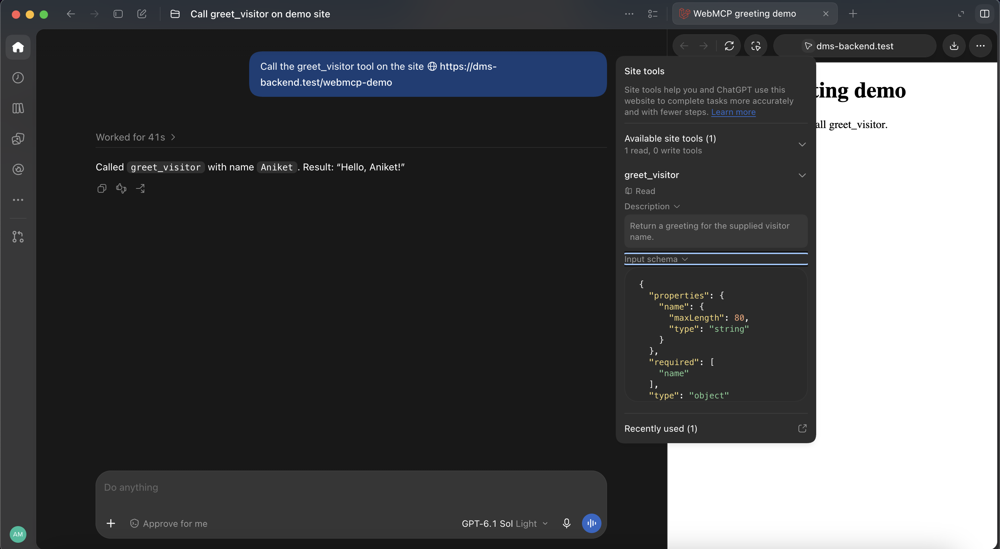
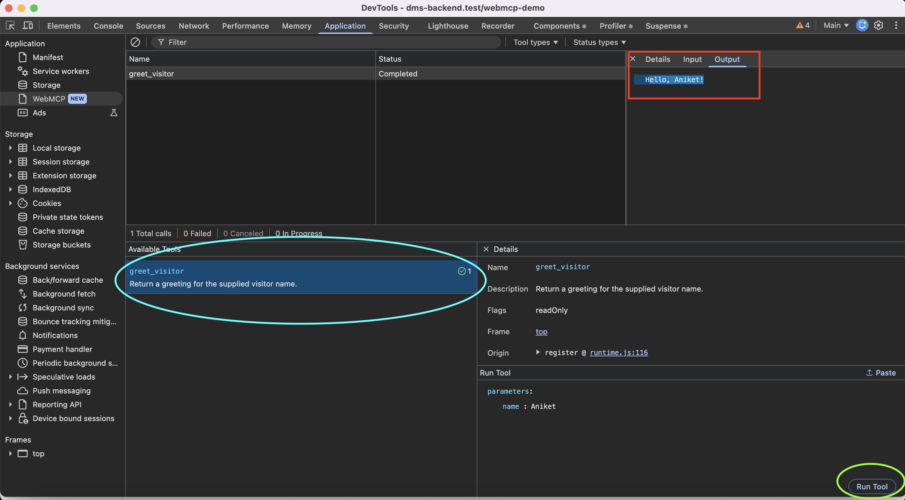
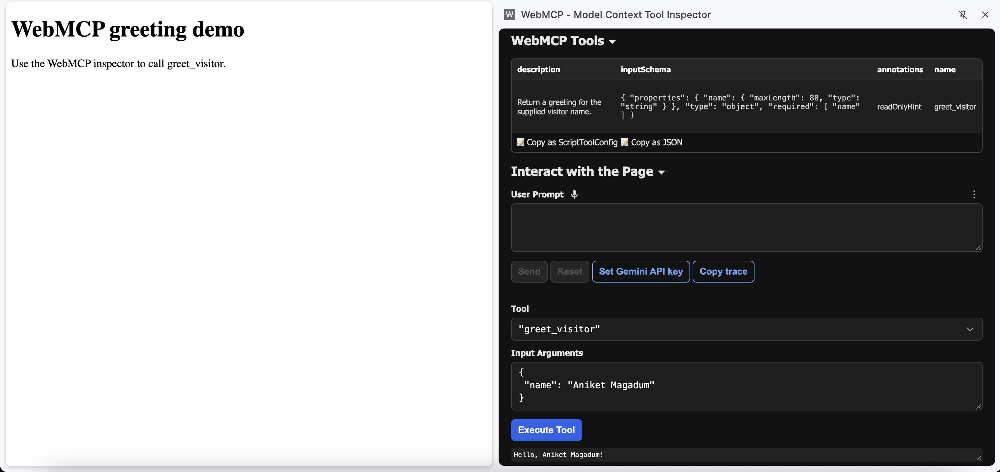
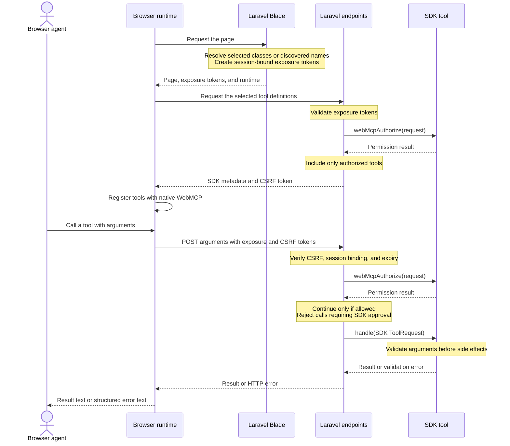

# Laravel WebMCP

[](CHANGELOG.md)
[](https://github.com/fosseva/laravel-web-mcp/actions/workflows/ci.yml)
[](composer.json)
[](composer.json)
[](LICENSE)

> [!WARNING]
> **Early preview: `v0.1.0-alpha.1`.** This package is under active development and is not a stable release. APIs, configuration, and browser behavior may change between prereleases. Use it for experimentation and feedback; evaluate it carefully before relying on it in production. WebMCP itself is also an evolving browser API.

Make your Laravel AI SDK tools available to browser agents through Blade. The same tool supplies its description, input schema, and handler for both SDK and WebMCP calls.

You choose which tools each page exposes. Browser calls use Laravel sessions, authorization, and CSRF protection.

## Why WebMCP?

Browser agents commonly interact with websites by inspecting screenshots, the DOM, or accessibility information, then clicking controls, filling forms, and reading the resulting page. This works on existing websites, but requires the agent to infer how the interface maps to the user's task.

[WebMCP](https://webmachinelearning.github.io/webmcp/#modelcontexttool-dictionary) lets a website expose named tools with descriptions and structured input schemas. An agent can discover an operation and call it with explicit arguments.

For example, searching for a product through the UI can involve finding the search field, typing a query, submitting the form, waiting for results, and extracting product details. With this package, the page can expose `search_products`, which the agent calls with `{"query": "keyboard"}` to receive the handler's result.

### 🎬 Watch: agentic booking with and without WebMCP

[](https://www.youtube.com/watch?v=CD67L_SIMDk)

**[▶ Watch the booking comparison](https://www.youtube.com/watch?v=CD67L_SIMDk)** by Alexandra Klepper. Click the thumbnail to open the video; GitHub READMEs do not support embedded iframe players.

The video compares agentic booking with and without WebMCP. Use it to relate the two approaches to a familiar task: an agent completing a booking on a website.

- **Traditional navigation:** the agent interprets page controls and coordinates clicks and form input to carry out the user's request.
- **WebMCP:** the website exposes operations with defined inputs that a supporting agent can discover and call.
- **How this package fits:** the same idea applies to your Laravel tools. A page exposes `search_products` or another SDK tool through Blade, and browser calls run its existing handler with server-side validation and authorization.

The booking example illustrates the interaction model; it is not a benchmark or a demonstration of this Laravel package.

Use this table as a reference for how the two approaches interact with a website.

| Aspect | 🖱️ Traditional AI agent navigation | 🛠️ WebMCP tool calls |
| --- | --- | --- |
| **Discovering actions** | Interpret screenshots, the DOM, or accessibility information to identify controls. | Read registered tool names, descriptions, and input schemas. |
| **Sending input** | Click controls, type into fields, and submit forms. | Call a named tool with structured arguments. |
| **Receiving results** | Inspect the updated page and interpret its feedback. | Receive the handler's result or error directly. |
| **Handling changes** | Reinspect the interface when layouts, labels, or controls change. | Follow the tool contract; changes to names, schemas, or behavior may require adaptation. |
| **Website setup** | Use the website's existing interface. | The website implements tools; this package exposes Laravel AI SDK handlers through Blade. |
| **Access control** | Use the browser session and the application's server-side permission checks. | This package uses the Laravel session, authorization, CSRF checks, and session-bound exposure tokens. |
| **Task coverage** | Interact with page controls and inspect visual content. | Execute exposed operations; use page navigation and inspection for other tasks. |
| **Browser requirements** | An agent capable of observing and controlling the browser. | A browser and agent supporting WebMCP, whose [specification is still a draft](https://webmachinelearning.github.io/webmcp/#sotd). |

WebMCP complements UI navigation. Expose tools for operations with clear inputs and results, and retain ordinary page controls for users and agents that need them.

> [!NOTE]
> WebMCP provides an explicit interface for agents; it does not guarantee faster execution, correct decisions, or safe side effects.

### Example applications and tools

These are tools you could implement in your application, rather than tools bundled with this package.

| Domain | Example tools | What an agent could help with |
| --- | --- | --- |
| **E-commerce** | `search_products`, `check_stock`, `add_to_cart` | Find matching products, check availability, and add a selected item to the user's cart. |
| **Appointment scheduling** | `find_available_slots`, `get_booking_details`, `reschedule_appointment` | Find a suitable time, inspect the user's booking, and request a schedule change. |
| **Customer support** | `search_help_articles`, `get_ticket_status`, `create_support_ticket` | Find relevant guidance, check an authorized ticket, and submit a new support request. |

Expose tools on the relevant pages and enforce user and resource permissions in each handler. Tools that change carts, bookings, or tickets also need input validation and any confirmation your application requires.

## Requirements

Start in an existing Laravel application's root directory, where `artisan` and `composer.json` live. This package is a Laravel library, not a standalone application.

You need:

- PHP 8.3 or newer and Composer.
- Laravel 12.62+ within Laravel 12, or Laravel 13.15+ within Laravel 13.
- A browser with WebMCP support for the browser testing steps below.

Check your application versions:

```bash
php -v
php artisan --version
```

## Installation

Run this command from your Laravel application's root directory:

```bash
composer require fosseva/laravel-web-mcp:0.1.0-alpha.1
```

This explicitly opts into the alpha release without lowering your application's global `minimum-stability`. The command requires this tag to be indexed on Packagist. For release changes, see the [changelog](CHANGELOG.md). Report bugs and share feedback through [GitHub issues](https://github.com/fosseva/laravel-web-mcp/issues), including your PHP, Laravel, and Chrome versions.

Composer also installs the Laravel AI SDK (`laravel/ai` 1.1+). Laravel discovers the service provider automatically; publishing configuration is optional. This demo calls a local handler directly, so it needs no AI provider API key.

## Usage: run your first tool

This greeting demo needs no database or login system. Complete the four steps below, then use the Chrome inspector to test the result.

### 1. Create a tool

```bash
php artisan make:tool GreetVisitor
```

Replace the generated `app/Ai/Tools/GreetVisitor.php` with this complete example, including the opening `<?php`:

```php
<?php

namespace App\Ai\Tools;

use Fosseva\WebMcp\Concerns\ProvidesWebMcpDefaults;
use Fosseva\WebMcp\Contracts\WebMcp;
use Illuminate\Contracts\JsonSchema\JsonSchema;
use Illuminate\Http\Request;
use Laravel\Ai\Contracts\Tool;
use Laravel\Ai\Tools\Request as ToolRequest;

class GreetVisitor implements Tool, WebMcp
{
    use ProvidesWebMcpDefaults;

    public function description(): string
    {
        return 'Return a greeting for the supplied visitor name.';
    }

    public function schema(JsonSchema $schema): array
    {
        return ['name' => $schema->string()->max(80)->required()];
    }

    public function webMcpAuthorize(Request $request): bool
    {
        // Allow this harmless demo only in the local development environment.
        return app()->environment('local');
    }

    public function webMcpAnnotations(): array
    {
        return ['readOnlyHint' => true];
    }

    public function handle(ToolRequest $request): string
    {
        $input = $request->validate([
            'name' => ['required', 'string', 'max:80'],
        ]);

        return 'Hello, '.$input['name'].'!';
    }
}
```

Both interfaces are required: `Tool` supplies the description, schema, and handler; `WebMcp` supplies browser exposure metadata and authorization. The trait names this tool `greet_visitor` automatically. Its default authorization denies access, so the example explicitly allows local use.

For real application tools, replace the demo authorization with your user's permissions and enforce resource access in the handler. Keep `APP_ENV=production` on production deployments.

### 2. Add a Blade page

Create `resources/views/webmcp-demo.blade.php`:

```blade
<!DOCTYPE html>
<html lang="en">
<head>
    <meta charset="utf-8">
    <title>WebMCP greeting demo</title>
</head>
<body>
    <h1>WebMCP greeting demo</h1>
    <p>Use the WebMCP inspector to call greet_visitor.</p>

    <x-webmcp::expose :tool="\App\Ai\Tools\GreetVisitor::class" />
</body>
</html>
```

The component registers a tool; it does not add a visible chat widget or button. It loads the package's browser runtime automatically, so no npm build or manual JavaScript include is required.

### 3. Add a route and start Laravel

Add this route to `routes/web.php`, which uses Laravel's session and CSRF middleware:

```php
\Illuminate\Support\Facades\Route::get('/webmcp-demo', function () {
    abort_unless(app()->environment('local'), 404);

    return view('webmcp-demo');
});
```

In your development `.env`, ensure `APP_ENV=local`. Use your application's existing session configuration. Then run:

```bash
php artisan optimize:clear
php artisan serve
```

Open `http://localhost:8000/webmcp-demo` in Chrome. Keep the terminal running. If you already use Herd, Valet, or another server, open `/webmcp-demo` on its HTTPS development URL instead.

### 4. Call the tool

Follow [Enable WebMCP in Chrome](#enable-webmcp-in-chrome) below, then reopen the demo page. In the inspector, select `greet_visitor` and use its manual execution controls with these arguments:

```json
{"name": "Aniket"}
```

The result should be:

```text
Hello, Aniket!
```

#### Example: ChatGPT discovers and calls the tool



This screenshot shows the greeting demo open beside a ChatGPT conversation. The **Site tools** panel lists `greet_visitor`, its description, and its input schema: a required string `name` with a maximum length of 80 characters. The conversation reports calling the tool with `name` set to `Aniket` and receiving `Hello, Aniket!`.

It connects the steps above to an agent interaction: the page exposes the tool, the client discovers its metadata, and the agent calls it to answer the user's request. This example uses a client with site-tool support; availability depends on your browser and agent environment.

#### Example: a successful call in Chrome DevTools



This snapshot shows the same demo in Chrome DevTools under **Application → WebMCP**, on a local development URL. If your Chrome build includes this panel, you can test the tool here as well as in the inspector extension:

1. **Cyan oval:** select `greet_visitor` under **Available Tools**. Its details show the description and read-only hint.
2. **Green oval:** set the `name` parameter to `Aniket` under **Run Tool**, then click **Run Tool**.
3. **Red rectangle:** select the completed call in the upper list and open **Output** to see `Hello, Aniket!`.

The **Completed** status confirms the call returned successfully. DevTools panel availability and layout may vary by Chrome version; the inspector instructions below provide another way to inspect and execute tools.

Try `{"name": ""}` next. The result should contain a validation error with status `422`. This shows the input schema describes the tool, while the handler also validates inputs on the server.

You now have the complete flow: **Blade page → registered browser tool → Laravel authorization and validation → SDK handler → result**. For an application example with a product model and user permissions, continue to [Opt in an existing SDK tool](#opt-in-an-existing-sdk-tool).

## Enable WebMCP in Chrome

WebMCP is the browser API used by this package. A remote MCP server or Chrome DevTools MCP connection is a separate integration; neither is required for this demo.

### 1. Enable the browser API

Chrome's [local WebMCP instructions](https://developer.chrome.com/docs/ai/webmcp/#local-webmcp) currently use this flag:

1. Open `chrome://flags/#enable-webmcp-testing` in Chrome's address bar.
2. Set **WebMCP for testing** to **Enabled**.
3. Click **Relaunch** and reopen the demo page.

The current [Model Context Tool Inspector listing](https://chromewebstore.google.com/detail/webmcp-model-context-tool/gbpdfapgefenggkahomfgkhfehlcenpd) requires Chrome **150.0.7861.0 or newer**. Check `chrome://version`; if the flag is missing, update Chrome or use a current Chrome Canary build. Flags and API availability can change.

### 2. Install the inspector

Install [WebMCP – Model Context Tool Inspector](https://chromewebstore.google.com/detail/webmcp-model-context-tool/gbpdfapgefenggkahomfgkhfehlcenpd), then open it from Chrome's extensions menu on the demo page. Use its tool list, input schema, manual execution controls, and results to inspect `greet_visitor`. Manual calls need no model API key.

#### Example: execute the greeting in the inspector



The page on the left exposes the tool through Blade. The inspector on the right shows its registration and a successful manual call:

1. **WebMCP Tools:** inspect the description, `inputSchema`, `readOnlyHint` annotation, and `greet_visitor` name.
2. **Tool:** select `greet_visitor` from the dropdown.
3. **Input Arguments:** enter `{"name": "Aniket Magadum"}`.
4. **Execute Tool:** click the button. The result beneath it should read `Hello, Aniket Magadum!`.

The **User Prompt** and **Set Gemini API key** controls belong to the optional agent mode. They are not needed for the manual call shown here. The greeting is returned in the inspector; this handler does not update the page's visible content.

> [!WARNING]
> The inspector's listing warns that it does not implement production security boundaries. Use it on trusted development pages.

### 3. Check browser support

On the demo page, open Chrome DevTools → **Console** and run:

```js
const context = document.modelContext || navigator.modelContext;
Boolean(context && typeof context.registerTool === 'function');
```

Expect `true`. This checks API availability, not whether a tool was registered. Use the inspector to verify registration and execute the greeting.

### 4. Understand how an agent uses it

The inspector can also test natural-language tool calls using its agent mode. Configure the model credentials it requests, then try: **“Greet a visitor named Aniket using the available tool.”** Inspect the selected tool, arguments, and returned greeting. This optional model setup is separate from Laravel's handler execution. See [Chrome's inspector guide](https://developer.chrome.com/docs/ai/webmcp/#imitate-agent-chat-with-the-inspector-extension).

Enabling the flag alone does not create an AI assistant. An agent or inspector must consume the registered tools.

### Troubleshooting your first call

| Symptom | What to check |
| --- | --- |
| Demo page returns 404 | Confirm the route exists and `APP_ENV=local`; run `php artisan optimize:clear`. |
| Browser support check returns `false` | Enable the flag, relaunch Chrome, and use HTTPS or localhost. |
| Inspector shows no tools | Open the Blade demo page, reload it, and check DevTools for errors. Confirm `WEBMCP_ENABLED` is not `false` and `webMcpAuthorize()` allows the request. |
| Manifest or execution returns 401/403 | Check login, route middleware, and tool authorization. The demo only allows the local environment. |
| Call returns 419 | Check session cookies and session storage; keep the `web` middleware and reload the page to renew CSRF and exposure tokens. |
| Call returns 422 | Supply a non-empty `name` of at most 80 characters. Inspect the returned validation fields. |
| A previously working tool stops working | Reload the page after exposure expiry or a session change. Check any changed permissions. |

## Opt in an existing SDK tool

Keep `Laravel\Ai\Contracts\Tool` on your tool class and add `Fosseva\WebMcp\Contracts\WebMcp`. Both interfaces are required.

`Tool` defines the description, schema, and handler. `WebMcp` adds the browser tool name, behavior hints, and authorization check.

Use the optional `ProvidesWebMcpDefaults` trait to supply these defaults:

| Method | Default |
| --- | --- |
| `webMcpName()` | The class name in snake_case, such as `search_products`. |
| `webMcpAnnotations()` | An empty array of behavior hints. |
| `webMcpAuthorize()` | `false`, denying browser access. |

Override `webMcpAuthorize()` with your application's authorization policy to allow access. Override the name or annotations only when you need different values.

```php
<?php

namespace App\Ai\Tools;

use Fosseva\WebMcp\Concerns\ProvidesWebMcpDefaults;
use Fosseva\WebMcp\Contracts\WebMcp;
use Illuminate\Contracts\JsonSchema\JsonSchema;
use Illuminate\Http\Request;
use Laravel\Ai\Contracts\Tool;
use Laravel\Ai\Tools\Request as ToolRequest;

class SearchProducts implements Tool, WebMcp
{
    use ProvidesWebMcpDefaults;

    public function description(): string
    {
        return 'Search the products available to the current user.';
    }

    public function schema(JsonSchema $schema): array
    {
        return ['query' => $schema->string()->min(2)->max(100)->required()];
    }

    public function webMcpAuthorize(Request $request): bool
    {
        return $request->user()?->can('viewAny', \App\Models\Product::class) ?? false;
    }

    public function handle(ToolRequest $request): string
    {
        $input = $request->validate(['query' => ['required', 'string', 'min:2', 'max:100']]);

        return \App\Models\Product::query()
            ->where('name', 'like', '%'.$input['query'].'%')
            ->limit(10)->get(['id', 'name'])->toJson();
    }

    public function webMcpAnnotations(): array
    {
        return ['readOnlyHint' => true];
    }
}
```

The schema tells the browser which arguments to send. Validate those arguments with the SDK request's `validate()` method inside `handle()`. This applies the same validation to SDK and browser calls.

Keep tenant filtering and resource authorization in the handler as well.

Override `webMcpName()` to choose a custom name. Names must be unique on the page and contain 1–128 letters, digits, underscores, dots, or hyphens.

Use `description()` for the tool's description. Use `webMcpAnnotations()` for boolean behavior hints, such as `readOnlyHint`. Annotations do not grant permissions.

### Tool annotation examples

The [current WebMCP draft](https://webmachinelearning.github.io/webmcp/#modelcontexttool-dictionary) defines these boolean annotations. Each defaults to `false` when omitted; browser support may vary.

| Annotation | Meaning when `true` | Example tool |
| --- | --- | --- |
| `readOnlyHint` | Reads data without changing state. | Search products. |
| `untrustedContentHint` | Returns content the tool author does not trust. | Read customer reviews. |
| `consequentialHint` | Performs a significant real-world or irreversible action. | Place an order or transfer money. |
| `debugging` | Intended for debugging or developer tooling. | Inspect application diagnostics. |

Override `webMcpAnnotations()` on the relevant tool. Hints can be combined when both apply.

A `ReadProductReviews` tool can read data while returning untrusted customer-written content:

```php
public function webMcpAnnotations(): array
{
    return [
        'readOnlyHint' => true,
        'untrustedContentHint' => true,
    ];
}
```

A `PlaceOrder` tool changes state and commits a purchase:

```php
public function webMcpAnnotations(): array
{
    return [
        'readOnlyHint' => false,
        'consequentialHint' => true,
    ];
}
```

An `InspectDiagnostics` tool intended for developers can identify itself as a debugging tool:

```php
public function webMcpAnnotations(): array
{
    return [
        'readOnlyHint' => true,
        'debugging' => true,
    ];
}
```

The package passes annotations to the browser unchanged. They do not enforce read-only execution, sanitize output, request approval, or restrict debugging tools to developers. Keep those checks in your authorization policy and handler. `consequentialHint` does not enable the SDK approval workflow described under [SDK boundaries](#sdk-boundaries).

## Expose tools in Blade

Add an exposure component to the page that needs the tool. The runtime loads once, even when the page exposes several tools.

### Expose a tool by class

Pass the tool class directly. This needs no entry in the package configuration.

```blade
<x-webmcp::expose :tool="\App\Ai\Tools\SearchProducts::class" />
```

### Expose a tool by its WebMCP name

Tools in `app/Ai/Tools` are discovered automatically when they implement both `Tool` and `WebMcp`. No tool list is needed.

Then use its `webMcpName()` value in Blade. With the default trait, `SearchProducts` has the name `search_products`.

```blade
<x-webmcp::expose name="search_products" />
```

Discovery allows name lookup; it does not expose tools automatically. Each tool still needs a Blade component and must pass authorization.

### Use a custom name

Override the method on your tool:

```php
public function webMcpName(): string
{
    return 'product_lookup';
}
```

Keep the tool in a discovery directory and use that name:

```blade
<x-webmcp::expose name="product_lookup" />
```

Names must be unique among the discovered tool classes. An unknown or duplicate name produces an error when rendering the component.

### Expose several tools

You can mix class-based and named exposure on the same page:

```blade
<x-webmcp::expose name="search_products" />
<x-webmcp::expose :tool="\App\Ai\Tools\CreateOrder::class" />
```

Exposing the same class more than once shares a single exposure token and browser registration. Provide either `tool` or `name` on each component.

### Expose a tool conditionally

Use ordinary Blade conditions to choose which tools a page includes:

```blade
@can('viewAny', \App\Models\Product::class)
    <x-webmcp::expose name="search_products" />
@endcan
```

`webMcpAuthorize()` still checks permission on the server before executing a call.

### Pass the name from a view variable

Use a bound attribute when the name comes from your controller or component:

```blade
{{-- $toolName = 'search_products' --}}
<x-webmcp::expose :name="$toolName" />
```

## Where to place an exposure

The exposure component works inside Blade files. Place it near the feature the tool supports. The named examples below assume `SearchProducts` is in `app/Ai/Tools`.

### A page view

Expose a tool only on the page that needs it, such as `resources/views/products/index.blade.php`:

```blade
@extends('layouts.app')

@section('content')
    <h1>Products</h1>
    <x-webmcp::expose name="search_products" />
@endsection
```

### A shared layout

Add an exposure to `resources/views/layouts/app.blade.php` when every page using that layout needs the tool:

```blade
<body>
    @yield('content')
    <x-webmcp::expose name="search_products" />
</body>
```

Every page extending this layout includes the tool. To limit it to product routes, wrap the component in a condition:

```blade
@if (request()->routeIs('products.*'))
    <x-webmcp::expose name="search_products" />
@endif
```

### A reusable Blade component

Include the exposure in `resources/views/components/product-browser.blade.php`:

```blade
<section>
    {{ $slot }}
    <x-webmcp::expose :tool="\App\Ai\Tools\SearchProducts::class" />
</section>
```

Any page rendering this component includes its tool:

```blade
<x-product-browser>
    <h2>Browse products</h2>
</x-product-browser>
```

Repeated instances share one tool registration and load the runtime once.

### An included partial

Group related exposures in `resources/views/partials/product-tools.blade.php`:

```blade
<x-webmcp::expose name="search_products" />
<x-webmcp::expose :tool="\App\Ai\Tools\CreateOrder::class" />
```

Include the partial on pages that need those tools:

```blade
@include('partials.product-tools')
```

### A Livewire view

Place the exposure inside the root element of a Livewire view, such as `resources/views/livewire/product-search.blade.php`:

```blade
<div>
    <h2>Product search</h2>
    <x-webmcp::expose name="search_products" />
</div>
```

The component loads the runtime when the view is first rendered with the page. Once loaded, the runtime refreshes registrations after Livewire navigation and DOM updates, removing tools whose exposure markers disappear.

In every location, Blade controls which tools are included on the page. `webMcpAuthorize()` controls whether the current user can list or execute them.

## How tool calls work



The diagram shows a successful call. Failed token, authorization, or approval checks return an error before the handler runs.

Each tool must implement both contracts and be rendered by Blade to receive an exposure token.

Blade creates an encrypted token for each selected tool. The token belongs to the current session and expires after 60 minutes by default.

The browser loads the tool definitions and registers them with the native WebMCP API. Each call resolves the tool through Laravel's container and passes its arguments to the existing SDK handler.

The handler's `string` or `Stringable` result is returned as text. If the handler returns JSON text, the bridge preserves it.

`webMcpAuthorize()` runs when listing tools and immediately before each call. The server rejects invalid, tampered, expired, or other-session tokens.

Removing a component unregisters the tool in the browser. Its issued token remains valid until expiry, so the server must continue to check authorization.

Reload the page when a token expires or the session ID changes.

## Configuration

```bash
php artisan vendor:publish --tag=webmcp-config
```

```php
return [
    'enabled' => env('WEBMCP_ENABLED', true),
    'path' => '_webmcp',
    'middleware' => ['web'],
    'exposure_ttl' => 60,
    'discovery' => [
        ['path' => app_path('Ai/Tools'), 'namespace' => 'App\\Ai\\Tools'],
    ],
];
```

Keep the `web` middleware for sessions and CSRF protection. Add `auth` and rate limiting as needed. Check tool-specific permissions in `webMcpAuthorize()` and the handler.

Clear Laravel's route cache after changing route configuration. Render tool exposures for each request; their tokens must not be shared through cached Blade output.

## Discovery and caching

The default discovery directory is `app/Ai/Tools`. Discovery includes concrete classes implementing both `Laravel\Ai\Contracts\Tool` and `Fosseva\WebMcp\Contracts\WebMcp`, including classes in nested directories.

For another PSR-4 directory, add its path and namespace to the `discovery` configuration. Class-based exposure works outside discovery directories too.

```php
'discovery' => [
    ['path' => app_path('Ai/Tools'), 'namespace' => 'App\\Ai\\Tools'],
    ['path' => app_path('Domain/Billing/Tools'), 'namespace' => 'App\\Domain\\Billing\\Tools'],
],
```

Without a cache, the package scans these directories when resolving a name. For production, Laravel's optimization commands manage the discovery cache automatically:

```bash
php artisan optimize
php artisan optimize:clear
```

You can also manage just the WebMCP discovery cache:

```bash
php artisan webmcp:cache
php artisan webmcp:clear
```

The cache lives at `bootstrap/cache/webmcp-tools.php` and stores only class names. Creating it does not instantiate tools. Tool names, schemas, and authorization are evaluated for each request.

Rebuild the cache after adding, moving, or removing tools, or changing discovery directories. Clearing it restores directory scanning. Discovery does not register tools in the browser; Blade exposure and authorization are still required.

## Routes and errors

The package registers three routes:

| Route | Purpose |
| --- | --- |
| `GET /_webmcp/manifest` | Load the selected tool definitions. |
| `POST /_webmcp/execute` | Execute an authorized tool call. |
| `GET /_webmcp/runtime.js` | Load the browser runtime. |

The runtime contains no user data. Tool manifests are private, and their cache identifiers include the CSRF token.

HTTP endpoints preserve Laravel error responses, including validation errors with status 422. The browser tool returns errors as JSON text with `error.status`, `error.message`, and `error.fields`. This lets an agent inspect the failure and correct its input.

## Browser lifecycle

Use a browser or agent environment with native WebMCP support over HTTPS or localhost. The runtime supports both `document.modelContext` and `navigator.modelContext`.

If WebMCP is unavailable, the runtime leaves ordinary page controls working and does not register tools.

The runtime refreshes tool registrations when the window gains focus, after Livewire navigation, and after Livewire DOM updates. It unregisters tools whose Blade markers disappear.

If authentication changes without navigation, notify the runtime:

```js
document.dispatchEvent(new CustomEvent('webmcp:auth-changed'));
```

Listen for `webmcp:registered`, `webmcp:unregistered`, `webmcp:sync`, and `webmcp:error` to track runtime activity.

After a CSRF failure, the runtime refreshes the manifest and retries once. Successful calls are not retried.

## SDK boundaries

The bridge executes local SDK tool handlers directly. It does not run an SDK agent or prompt a model, so the bridge itself needs no provider API key.

Agent middleware, conversation state, tool invocation events, and agent-specific constructor arguments are not applied. Bind tool dependencies in Laravel's container and keep user-specific state out of singleton tools.

If an SDK `Approvable` tool requests approval, the bridge rejects the call with HTTP 409. Browser approval workflows are not supported.

Provider-hosted tools and remote MCP tools are outside this package's scope.

## Development

```bash
composer install
composer ci:check
```

The [CI workflow](.github/workflows/ci.yml) runs on pushes, pull requests, and manual dispatches. It checks PHP 8.3–8.5 against Laravel 12 and 13 using the matching Testbench version. Each job validates Composer metadata and runs Pint, PHPStan, Pest, and the Node.js runtime tests through `composer ci:check`.

PHP tests cover SDK execution, validation, authorization, session tokens, approval requirements, and manifest caching.

JavaScript tests cover browser registration, execution errors, and CSRF retries.
