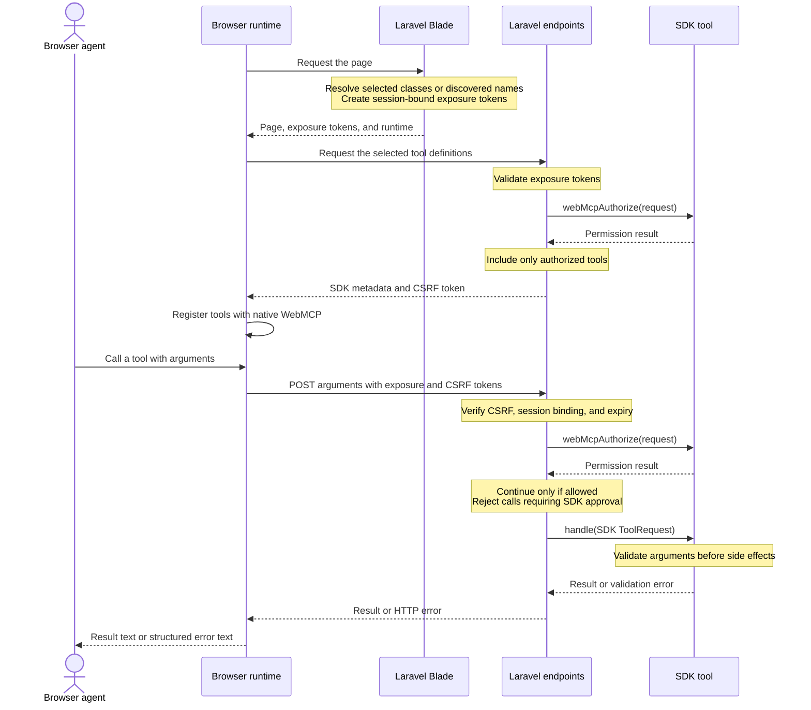

# Laravel WebMCP

Make your Laravel AI SDK tools available to browser agents through Blade. The same tool supplies its description, input schema, and handler for both SDK and WebMCP calls.

You choose which tools each page exposes. Browser calls use Laravel sessions, authorization, and CSRF protection.

Requires PHP 8.3+, Laravel 12.62+ or 13.15+, and `laravel/ai` 1.1+.

## Install

```bash
composer require fosseva/laravel-web-mcp
```

The Laravel AI SDK is installed as a dependency. Use its `php artisan make:tool` command to create tools.

## Opt in an existing SDK tool

Keep `Laravel\Ai\Contracts\Tool` on your tool class and add `Fosseva\WebMcp\Contracts\WebMcp`. Both interfaces are required.

`Tool` defines the description, schema, and handler. `WebMcp` adds the browser tool name, behavior hints, and authorization check.

Use the optional `ProvidesWebMcpDefaults` trait to supply these defaults:

| Method | Default |
| --- | --- |
| `webMcpName()` | The class name in snake_case, such as `search_products`. |
| `webMcpAnnotations()` | An empty array of behavior hints. |
| `webMcpAuthorize()` | `false`, denying browser access. |

Override `webMcpAuthorize()` with your application's authorization policy to allow access. Override the name or annotations only when you need different values.

```php
namespace App\Ai\Tools;

use Fosseva\WebMcp\Concerns\ProvidesWebMcpDefaults;
use Fosseva\WebMcp\Contracts\WebMcp;
use Illuminate\Contracts\JsonSchema\JsonSchema;
use Illuminate\Http\Request;
use Laravel\Ai\Contracts\Tool;
use Laravel\Ai\Tools\Request as ToolRequest;

class SearchProducts implements Tool, WebMcp
{
    use ProvidesWebMcpDefaults;

    public function description(): string
    {
        return 'Search the products available to the current user.';
    }

    public function schema(JsonSchema $schema): array
    {
        return ['query' => $schema->string()->min(2)->max(100)->required()];
    }

    public function webMcpAuthorize(Request $request): bool
    {
        return $request->user()?->can('viewAny', \App\Models\Product::class) ?? false;
    }

    public function handle(ToolRequest $request): string
    {
        $input = $request->validate(['query' => ['required', 'string', 'min:2', 'max:100']]);

        return \App\Models\Product::query()
            ->where('name', 'like', '%'.$input['query'].'%')
            ->limit(10)->get(['id', 'name'])->toJson();
    }

    public function webMcpAnnotations(): array
    {
        return ['readOnlyHint' => true];
    }
}
```

The schema tells the browser which arguments to send. Validate those arguments with the SDK request's `validate()` method inside `handle()`. This applies the same validation to SDK and browser calls.

Keep tenant filtering and resource authorization in the handler as well.

Override `webMcpName()` to choose a custom name. Names must be unique on the page and contain 1–128 letters, digits, underscores, dots, or hyphens.

Use `description()` for the tool's description. Use `webMcpAnnotations()` for boolean behavior hints, such as `readOnlyHint`. Annotations do not grant permissions.

## Expose tools in Blade

Add an exposure component to the page that needs the tool. The runtime loads once, even when the page exposes several tools.

### Expose a tool by class

Pass the tool class directly. This needs no entry in the package configuration.

```blade
<x-webmcp::expose :tool="\App\Ai\Tools\SearchProducts::class" />
```

### Expose a tool by its WebMCP name

Tools in `app/Ai/Tools` are discovered automatically when they implement both `Tool` and `WebMcp`. No tool list is needed.

Then use its `webMcpName()` value in Blade. With the default trait, `SearchProducts` has the name `search_products`.

```blade
<x-webmcp::expose name="search_products" />
```

Discovery allows name lookup; it does not expose tools automatically. Each tool still needs a Blade component and must pass authorization.

### Use a custom name

Override the method on your tool:

```php
public function webMcpName(): string
{
    return 'product_lookup';
}
```

Keep the tool in a discovery directory and use that name:

```blade
<x-webmcp::expose name="product_lookup" />
```

Names must be unique among the discovered tool classes. An unknown or duplicate name produces an error when rendering the component.

### Expose several tools

You can mix class-based and named exposure on the same page:

```blade
<x-webmcp::expose name="search_products" />
<x-webmcp::expose :tool="\App\Ai\Tools\CreateOrder::class" />
```

Exposing the same class more than once shares a single exposure token and browser registration. Provide either `tool` or `name` on each component.

### Expose a tool conditionally

Use ordinary Blade conditions to choose which tools a page includes:

```blade
@can('viewAny', \App\Models\Product::class)
    <x-webmcp::expose name="search_products" />
@endcan
```

`webMcpAuthorize()` still checks permission on the server before executing a call.

### Pass the name from a view variable

Use a bound attribute when the name comes from your controller or component:

```blade
{{-- $toolName = 'search_products' --}}
<x-webmcp::expose :name="$toolName" />
```

## Where to place an exposure

The exposure component works inside Blade files. Place it near the feature the tool supports. The named examples below assume `SearchProducts` is in `app/Ai/Tools`.

### A page view

Expose a tool only on the page that needs it, such as `resources/views/products/index.blade.php`:

```blade
@extends('layouts.app')

@section('content')
    <h1>Products</h1>
    <x-webmcp::expose name="search_products" />
@endsection
```

### A shared layout

Add an exposure to `resources/views/layouts/app.blade.php` when every page using that layout needs the tool:

```blade
<body>
    @yield('content')
    <x-webmcp::expose name="search_products" />
</body>
```

Every page extending this layout includes the tool. To limit it to product routes, wrap the component in a condition:

```blade
@if (request()->routeIs('products.*'))
    <x-webmcp::expose name="search_products" />
@endif
```

### A reusable Blade component

Include the exposure in `resources/views/components/product-browser.blade.php`:

```blade
<section>
    {{ $slot }}
    <x-webmcp::expose :tool="\App\Ai\Tools\SearchProducts::class" />
</section>
```

Any page rendering this component includes its tool:

```blade
<x-product-browser>
    <h2>Browse products</h2>
</x-product-browser>
```

Repeated instances share one tool registration and load the runtime once.

### An included partial

Group related exposures in `resources/views/partials/product-tools.blade.php`:

```blade
<x-webmcp::expose name="search_products" />
<x-webmcp::expose :tool="\App\Ai\Tools\CreateOrder::class" />
```

Include the partial on pages that need those tools:

```blade
@include('partials.product-tools')
```

### A Livewire view

Place the exposure inside the root element of a Livewire view, such as `resources/views/livewire/product-search.blade.php`:

```blade
<div>
    <h2>Product search</h2>
    <x-webmcp::expose name="search_products" />
</div>
```

The component loads the runtime when the view is first rendered with the page. Once loaded, the runtime refreshes registrations after Livewire navigation and DOM updates, removing tools whose exposure markers disappear.

In every location, Blade controls which tools are included on the page. `webMcpAuthorize()` controls whether the current user can list or execute them.

## How tool calls work



The diagram shows a successful call. Failed token, authorization, or approval checks return an error before the handler runs.

Each tool must implement both contracts and be rendered by Blade to receive an exposure token.

Blade creates an encrypted token for each selected tool. The token belongs to the current session and expires after 60 minutes by default.

The browser loads the tool definitions and registers them with the native WebMCP API. Each call resolves the tool through Laravel's container and passes its arguments to the existing SDK handler.

The handler's `string` or `Stringable` result is returned as text. If the handler returns JSON text, the bridge preserves it.

`webMcpAuthorize()` runs when listing tools and immediately before each call. The server rejects invalid, tampered, expired, or other-session tokens.

Removing a component unregisters the tool in the browser. Its issued token remains valid until expiry, so the server must continue to check authorization.

Reload the page when a token expires or the session ID changes.

## Configuration

```bash
php artisan vendor:publish --tag=webmcp-config
```

```php
return [
    'enabled' => env('WEBMCP_ENABLED', true),
    'path' => '_webmcp',
    'middleware' => ['web'],
    'exposure_ttl' => 60,
    'discovery' => [
        ['path' => app_path('Ai/Tools'), 'namespace' => 'App\\Ai\\Tools'],
    ],
];
```

Keep the `web` middleware for sessions and CSRF protection. Add `auth` and rate limiting as needed. Check tool-specific permissions in `webMcpAuthorize()` and the handler.

Clear Laravel's route cache after changing route configuration. Render tool exposures for each request; their tokens must not be shared through cached Blade output.

## Discovery and caching

The default discovery directory is `app/Ai/Tools`. Discovery includes concrete classes implementing both `Laravel\Ai\Contracts\Tool` and `Fosseva\WebMcp\Contracts\WebMcp`, including classes in nested directories.

For another PSR-4 directory, add its path and namespace to the `discovery` configuration. Class-based exposure works outside discovery directories too.

```php
'discovery' => [
    ['path' => app_path('Ai/Tools'), 'namespace' => 'App\\Ai\\Tools'],
    ['path' => app_path('Domain/Billing/Tools'), 'namespace' => 'App\\Domain\\Billing\\Tools'],
],
```

Without a cache, the package scans these directories when resolving a name. For production, Laravel's optimization commands manage the discovery cache automatically:

```bash
php artisan optimize
php artisan optimize:clear
```

You can also manage just the WebMCP discovery cache:

```bash
php artisan webmcp:cache
php artisan webmcp:clear
```

The cache lives at `bootstrap/cache/webmcp-tools.php` and stores only class names. Creating it does not instantiate tools. Tool names, schemas, and authorization are evaluated for each request.

Rebuild the cache after adding, moving, or removing tools, or changing discovery directories. Clearing it restores directory scanning. Discovery does not register tools in the browser; Blade exposure and authorization are still required.

## Routes and errors

The package registers three routes:

| Route | Purpose |
| --- | --- |
| `GET /_webmcp/manifest` | Load the selected tool definitions. |
| `POST /_webmcp/execute` | Execute an authorized tool call. |
| `GET /_webmcp/runtime.js` | Load the browser runtime. |

The runtime contains no user data. Tool manifests are private, and their cache identifiers include the CSRF token.

HTTP endpoints preserve Laravel error responses, including validation errors with status 422. The browser tool returns errors as JSON text with `error.status`, `error.message`, and `error.fields`. This lets an agent inspect the failure and correct its input.

## Browser lifecycle

Use a browser or agent environment with native WebMCP support over HTTPS or localhost. The runtime supports both `document.modelContext` and `navigator.modelContext`.

If WebMCP is unavailable, the runtime leaves ordinary page controls working and does not register tools.

The runtime refreshes tool registrations when the window gains focus, after Livewire navigation, and after Livewire DOM updates. It unregisters tools whose Blade markers disappear.

If authentication changes without navigation, notify the runtime:

```js
document.dispatchEvent(new CustomEvent('webmcp:auth-changed'));
```

Listen for `webmcp:registered`, `webmcp:unregistered`, `webmcp:sync`, and `webmcp:error` to track runtime activity.

After a CSRF failure, the runtime refreshes the manifest and retries once. Successful calls are not retried.

## SDK boundaries

The bridge executes local SDK tool handlers directly. It does not run an SDK agent or prompt a model, so the bridge itself needs no provider API key.

Agent middleware, conversation state, tool invocation events, and agent-specific constructor arguments are not applied. Bind tool dependencies in Laravel's container and keep user-specific state out of singleton tools.

If an SDK `Approvable` tool requests approval, the bridge rejects the call with HTTP 409. Browser approval workflows are not supported.

Provider-hosted tools and remote MCP tools are outside this package's scope.

## Development

```bash
composer install
composer test
node --test tests/runtime.test.cjs
```

PHP tests cover SDK execution, validation, authorization, session tokens, approval requirements, and manifest caching.

JavaScript tests cover browser registration, execution errors, and CSRF retries.
